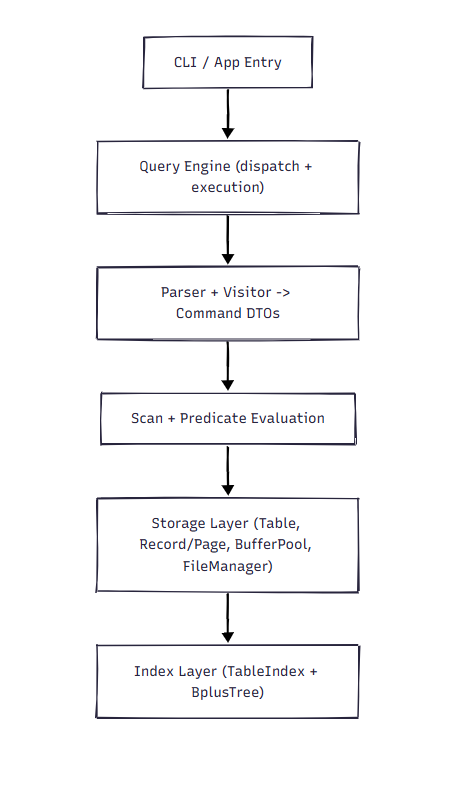

# Lite-SQLite Architecture

This document describes the current architecture of the Lite-SQLite project: what each component does, how they interact, and what tradeoffs/limitations exist today.

## 1) System Overview

Lite-SQLite is a lightweight relational database engine with these major concerns:

- SQL parsing and command modeling
- Query/update execution
- Predicate evaluation
- Storage and page layout
- Buffer management
- Indexing with B+ trees

Supported operations currently include:

- `CREATE TABLE`
- `INSERT`
- `SELECT`
- `UPDATE`
- `DELETE`
- `CREATE INDEX` (unique and non-unique)

## 2) High-Level Layers

## 3) Package-Level Architecture

### `lite.sqlite.server.parser`

- `ParserImpl`: wraps ShardingSphere parser setup and visitor traversal.
- `MySqlStatementVisitor`: converts parsed SQL AST into internal command objects.

Key output from parser layer:

- command DTOs in `lite.sqlite.server.model.domain.commands.*`

### `lite.sqlite.server.model.domain.commands`

Command data transfer objects used by `QueryEngineImpl`:

- `CreateTableData`
- `InsertData`
- `QueryData`
- `UpdateData`
- `DeleteData`
- `CreateIndexData`
- `CommandType`

### `lite.sqlite.server.queryengine`

- `QueryEngine` interface
- `QueryEngineImpl` concrete execution engine

Responsibilities:

- parse incoming SQL
- dispatch by command type
- execute CRUD and index operations
- choose index path vs full scan for simple equality predicates
- apply predicates/projection
- flush/close storage resources

### `lite.sqlite.server.model.domain.clause`

Expression/predicate model:

- `DBPredicate`: conjunction (`AND`) of terms
- `DBTerm`: one comparison term (`=`, `>`, `<`, `LIKE`)
- `DBConstant`: typed constant value wrapper
- `DBExpression`: expression abstraction
- `ComparisonOperator`: operator enum

### `lite.sqlite.server.scan`

- `RORecordScan`: read-only field access interface
- `RORecordScanImpl`: resolves field values by schema + record

Used to evaluate predicates against records without coupling predicate logic to storage internals.

### `lite.sqlite.server.storage`

Core persistent data path:

- `BasicFileManager` + `FileManager`: block-level disk I/O and table file lifecycle
- `BufferPool`: in-memory page cache / pin-unpin / dirty tracking
- `Page`: fixed-size page abstraction
- `Block`: physical identifier (`fileName + blockNumber`)
- `Table`: table abstraction, record insert/get/iterate and index management
- `RecordId`: logical pointer to row location (`Block + slot`)

Record-format subpackage `storage.record`:

- `SlottedRecordPage`: slotted-page record manager
- `Record`, `Schema`, `Column`, `DataType`

Index subpackage `storage.index`:

- `TableIndex<K>`: table-facing index wrapper (unique/non-unique)

### `lite.sqlite.server.datastructure.BplusTree`

- `BplusTree<K,V>`
- `BplusTreeNode<K,V>`

Provides key->RecordId mapping used by `TableIndex`.

## 4) End-to-End Request Flow

## 4.1 SELECT flow

1. SQL enters `QueryEngineImpl.doQuery`.
2. `ParserImpl` + `MySqlStatementVisitor` produce `QueryData`.
3. Engine resolves table from in-memory table map.
4. Candidate row discovery:
   - try index for single-term equality predicate on indexed column
   - fall back to full table iteration
5. Predicate filtering using `DBPredicate` + `RORecordScanImpl`.
6. Projection applied to selected columns.
7. Result returned as `TableDto`.

## 4.2 INSERT flow

1. SQL enters `QueryEngineImpl.doUpdate`.
2. Parsed to `InsertData`.
3. Values converted to schema types.
4. `Table.insertRecord` locates insertable block (or appends one).
5. `SlottedRecordPage.insert` writes record bytes and slot metadata.
6. Registered indexes are updated with new `RecordId`.
7. Buffer pool flush triggered.

## 4.3 UPDATE flow

1. SQL parsed to `UpdateData` (fields + values + predicate).
2. Engine scans all blocks/pages for matching rows.
3. Matching rows updated via `SlottedRecordPage.update(slot, values)`.
4. Table indexes are rebuilt to keep key->RecordId mappings consistent.
5. Buffer pool flush.

## 4.4 DELETE flow

1. SQL parsed to `DeleteData`.
2. Engine scans blocks/pages for matching rows.
3. Matching rows deleted via `SlottedRecordPage.delete(slot)`.
4. Table indexes rebuilt.
5. Buffer pool flush.

## 4.5 CREATE INDEX flow

1. SQL parsed to `CreateIndexData` (name, table, column, unique flag).
2. Engine validates table + column.
3. `Table.createTypedIndex(...)` constructs index by column type.
4. Existing rows are scanned and inserted into index.

## 5) Storage Design

## 5.1 Page model

- Fixed page size (`Page.PAGE_SIZE`, currently 4096 bytes).
- `SlottedRecordPage` maintains:
  - header (record count / free-space pointer)
  - slot directory
  - variable-length record payloads

## 5.2 Record addressing

Each row is identified by:

- file block (`Block`)
- slot index in that block

Combined as `RecordId`.

## 5.3 Buffer management

`BufferPool` owns resident pages and dirty tracking.

- `pinBlock` / `unpinBlock` manage page residency usage.
- dirty pages are flushed through file manager.
- replacement helper structures include `LRUCache`.

## 6) Index Architecture

`TableIndex<K>` wraps `BplusTree<K, RecordId>`.

- unique index path:
  - `search(key)` returns one `RecordId`
- non-unique path:
  - `searchAll(key)` returns all matching `RecordId`s

`QueryEngineImpl` uses index lookup for simple equality predicates, then fetches full records by `RecordId`.

## 7) In-Memory Runtime State

`QueryEngineImpl` maintains:

- `Map<String, Table> tables` (concurrent map)
- shared `BufferPool`
- shared `BasicFileManager`

Note: table metadata registration is runtime map-driven; table re-discovery/persistent catalog management is still limited.

## 8) Error Handling Strategy

- Command execution methods return `TableDto.forError(...)` for user-facing failures.
- Lower-level exceptions are caught in engine paths, typically with fallback (e.g., full scan when index path fails).
- Some paths still print stack traces directly (`printStackTrace`) and can be improved with structured logging.

## 9) Testing Coverage (Current Focus)

The test suite currently includes:

- Query engine CRUD scenarios
- index behavior for unique/non-unique lookup
- slotted-record-page insert/update/delete/compaction behavior

Recent additions include:

- update/delete integration in query engine tests
- `DBTerm` edge-case tests for null and operator behavior

## 10) Known Limitations / Future Improvements

- no transaction manager / WAL / recovery
- no SQL `NULL` 3-valued logic semantics
- parser and execution currently support a subset of SQL
- index maintenance on update/delete uses rebuild strategy (simple but expensive)
- no optimizer/planner beyond basic equality-index shortcut
- limited persistent metadata/catalog model

## 11) Suggested Next Architectural Steps

1. Add transaction + write-ahead logging boundaries.
2. Introduce persistent catalog metadata for table/index bootstrap.
3. Add incremental index maintenance APIs (`insert`, `delete`, `update-key`) to avoid full rebuilds.
4. Expand predicate/parser support (`AND`/`OR` composition, better expression parsing).
5. Add execution planning abstraction (scan node, index scan node, filter node, project node).
